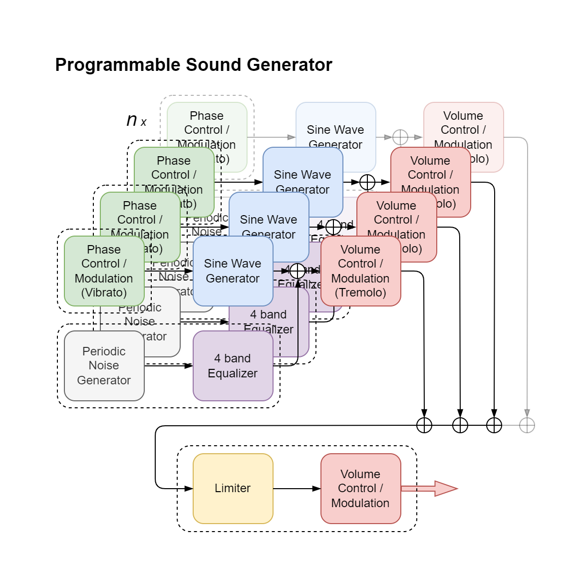

# PSG

To produce announcement and alarm tones by e.g. an intercom, an FPGA based intercom could have a programmable sound generator (PSG) module. The configurable PSG is able to generate (synthesize) and mix a minimum of three tones. The PSG module is composed of several submodules: (optional) phase control/modulation (vibrato), sine wave generator, volume control/modulation (tremolo), (optional) periodic noise generator with four band equalizer and (optional) limiter with volume control/modulation. The volume of the (optional) periodic noise generator is controlled by the equalizer. A PSG minimum configuration of three tones does not mean the generated sound is limited to three tones; it is limited to three overlapping (simultaneous) tones.

The volume control of a single tone allows increase and decrease of the volume (amplitude) according to a defined envelope. The volume envelope increases from zero to a set volume with an attack rate (AR), then decreases to zero with a single decrease rate (RR) or multiple decrease rates (<i>n</i> <small>x</small> DR) where the last decrease rate to zero is named the release rate (RR). The timed volume envelope increase of decrease rates could be linear, exponential, circular or parabola shaped. One or more of the multiple decrease rates could be hold to zero, the amplitude level is sustained (SL).

The PSG test bench shows several examples how to generate WAVE audio files (simulation - no hardware required).

